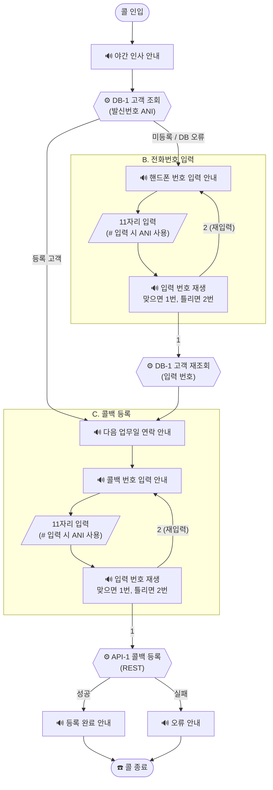
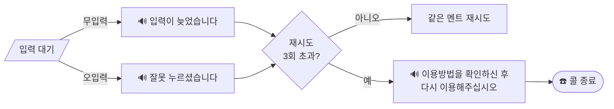

IVR 콜백 등록 시스템 구현

> 실제 고객사(메디포스트) 대표번호 IVR에서 발췌한 시나리오입니다.

---

## 1. 개요

상담원이 부재중일 때(야간/점심시간) 고객의 **콜백 요청을 접수**하는 IVR 서비스를 구현한다.

| 항목    | 내용                                              |
| ----- | ----------------------------------------------- |
| 범위    | 고객 조회(DB SELECT) → 전화번호 입력/확인 → 콜백 등록(REST API) |
| 구현 형태 | 자유                                              |
| 기술 스택 | 자유                                              |
| 제공 환경 | 고객 DB(테이블·테스트 데이터 포함), mock 콜백 등록 API 서버        |

### 목표

1. IVR 콜 플로우 설계하는 방법을 익힌다.
2. 콜 플로우 안에서 DB 조회 로직을 안전하게 처리한다 (자원 해제, 오류 시 콜 유지).
3. 외부 시스템과의 REST API 연동과 응답 파싱, 실패 처리를 구현한다.
4. 무입력/오입력/재시도 초과 등 **IVR 예외 흐름**을 처리한다.

---

## 2. 시나리오 — 멘트 플로우

멘트는 실제 상용 IVR 원문 그대로이며, 반드시 이 문구와 분기 구조를 따라야 한다.
(🔊 = 안내 멘트 재생, ⚙️ = 서버 로직, ☎️ = 콜 종료)

### 전체 흐름도

**입력 예외 공통 흐름** (모든 입력 단계에 동일 적용):

### A. 인입 / 인사

> 🔊 "죄송합니다. 지금은 업무시간이 종료되었습니다."

**⚙️ [DB-1] 고객 조회** — 발신번호(ANI)로 고객 정보 조회

- 등록 고객 (조회됨) → **C단계**로 이동
- 미등록 고객 (조회 안 됨) → **B단계**로 이동

### B. 전화번호 입력 (미등록 고객)

> 🔊 "산모 또는 배우자의 핸드폰 번호 열한 자리를 눌러주십시오.
> 지금 거신 전화번호를 누르시려면 우물정자를 눌러주십시오."

- 핸드폰 번호 11자리 입력 → 입력한 번호 사용 (11자리가 모두 입력되면 자동으로 다음 단계 진행)
- `#`만 입력 → 발신번호(ANI)를 그대로 사용

> 🔊 *(입력한 번호 재생)* "맞으면 1번, 틀리면 2번을 눌러주십시오."

- `1` → **⚙️ [DB-1] 고객 조회** (입력 번호로 재조회) → **C단계**
- `2` → 번호 입력 멘트로 복귀 (재입력)

### C. 콜백 등록

> 🔊 "번호를 남겨주시면 다음 업무일에 연락드리겠습니다."

> 🔊 "연락받으실 핸드폰 번호 열한 자리를 눌러주십시오.
> 지금 거신 전화번호를 남기시려면 우물정자를 눌러주십시오."

- 핸드폰 번호 11자리 입력 → 입력한 번호 사용 (11자리가 모두 입력되면 자동으로 다음 단계 진행)
- `#`만 입력 → 발신번호(ANI)를 그대로 사용

> 🔊 *(입력한 번호 재생)* "맞으면 1번, 틀리면 2번을 눌러주십시오."

- `2` → 콜백번호 입력 멘트로 복귀
- `1` → **⚙️ [API-1] 콜백 등록**

등록 **성공** 시:

> 🔊 "등록되었습니다. 확인후 연락드리도록 하겠습니다. 이용해주셔서 감사합니다."

등록 **실패** 시 (등록이 안 됐는데 "등록되었습니다"라고 안내하면 안 된다):

> 🔊 "이용방법을 확인하신 후 다시 이용해주십시오."

☎️ 콜 종료

### 입력 예외 공통 규칙 (모든 입력 단계 동일 적용)

| 상황 | 처리 |
|---|---|
| 무입력 | 🔊 "입력이 늦었습니다." → 같은 멘트 재시도 |
| 오입력 (허용되지 않은 키) | 🔊 "잘못 누르셨습니다." → 같은 멘트 재시도 |
| 재시도 3회 초과 | 🔊 "이용방법을 확인하신 후 다시 이용해주십시오." → ☎️ 콜 종료 |

---

## 3. 인터페이스 명세

### [DB-1] 고객 조회 (SELECT)

| 항목    | 내용                                                      |
| ----- | ------------------------------------------------------- |
| 입력    | 조회할 전화번호 — `PHONE_NO` 컬럼과 매칭 (`WHERE PHONE_NO = ?`)                                |
| 출력 컬럼 | `CU_CO_NAME` (고객명), `BIRTHDAY` (생년월일) |
| 오류 처리 | DB 오류가 발생해도 **콜을 끊지 않는다.** 로그 남기고 미등록 고객과 동일하게 진행       |

**접속 정보**

| 항목 | 값 |
|---|---|
| Host / Port | `192.168.40.200` / `3306` |
| Database | `ivr` |
| 계정 | `root` / `ivr123!` |
| 테이블 | `CUST_INFO` |

JDBC 예: `jdbc:mariadb://192.168.40.200:3306/ivr`

**테이블 `CUST_INFO`**

| 컬럼           | 타입          | 설명                                            |
| ------------ | ----------- | --------------------------------------------- |
| `SEQ`        | INT (PK)    | 내부 일련번호                                       |
| `PHONE_NO`   | VARCHAR(20) | 전화번호 — **숫자만 저장(하이픈 없음)**. ANI·DTMF와 형식을 맞출 것 |
| `CU_CO_NAME` | VARCHAR(50) | 고객명                                           |
| `BIRTHDAY`   | CHAR(8)     | 생년월일 `YYYYMMDD`                               |
| `REG_DT`     | DATETIME    | 등록일시                                          |

**테스트 데이터**

| PHONE_NO | 고객명 | 성격 |
|---|---|---|
| `01012345678` | 홍길동 | 등록 고객 |
| `01023456789` | 김철수 | 등록 고객 |
| `01055556666` | 이영희 | 등록 고객 |
| `01099998888` | — | 미등록 (테이블에 없음) |

### [API-1] 콜백 등록 (REST)

콜백 번호 확인이 끝나면 콜백 접수 시스템에 REST API로 등록한다.
mock 서버가 **과제와 함께 제공된다** (FastAPI, docker 기동).

| 항목    | 내용                                                                                      |
| ----- | --------------------------------------------------------------------------------------- |
| 요청    | `POST http://192.168.40.200:18080/api/v1/callbacks` (본문 JSON, UTF-8)                    |
| 요청 본문 | `{ "callbackNumber": "<콜백 받을 번호>", "ani": "<발신번호>", "custName": "<고객명, 미등록이면 빈 문자열>" }` |
| 정상 응답 | HTTP 200 + `{ "code": "0000", "callbackId": "<접수ID>" }`                                 |
| 성공 판정 | HTTP 200 이면서 응답의 `code`가 `"0000"`인 경우만 성공                                               |
| 타임아웃  | 연결/응답 각 **3초** — 초과 시 실패로 간주                                                            |
| 성공 시  | `callbackId`를 로그에 남기고 등록 완료 멘트로 이동                                                      |
| 실패 시  | 오류 로그를 남기고 **오류 안내 멘트 후 정상 종료** (완료 멘트를 내보내면 안 된다)                                      |
| 등록 확인 | `GET http://192.168.40.200:18080/api/v1/callbacks` — 등록된 목록 반환 (확인용)                    |
| 실패 재현 | 요청 본문에 `"delay": true` 추가 → 서버가 10초 지연 응답 → 클라이언트가 3초 타임아웃                              |

---

## 4. 구현 요구사항

### 필수 요구사항

1. A → B → C 전체 플로우 구현 (멘트 문구·분기·예외 규칙 준수)
2. [DB-1] 고객 조회 — 실제 DB 연동
3. [API-1] 콜백 등록 — 제공되는 mock 서버와 REST 연동, 성공/실패 두 경로 모두 동작할 것
4. 등록 고객 / 미등록 고객 / DB 장애 3가지 경로가 모두 동작할 것
5. 각 단계 진입·DB/API 호출 결과를 타임스탬프와 함께 로그로 출력할 것

### 제약 사항

- DB 커넥션, ResultSet 등 자원은 오류 발생 여부와 관계없이 반드시 해제할 것 (`finally` 또는 try-with-resources)
- DB/API 오류가 사용자(콜)에게 예외 스택으로 노출되면 안 된다 — 안내 멘트와 흐름으로 처리
- 멘트는 IVR phraseset 파일 하나로 관리한다
- 과제 완료 후 `workspace/{프로젝트}` 프로젝트 폴더 전체를 압축하여 GitHub `main` 브랜치에 푸시할 것
